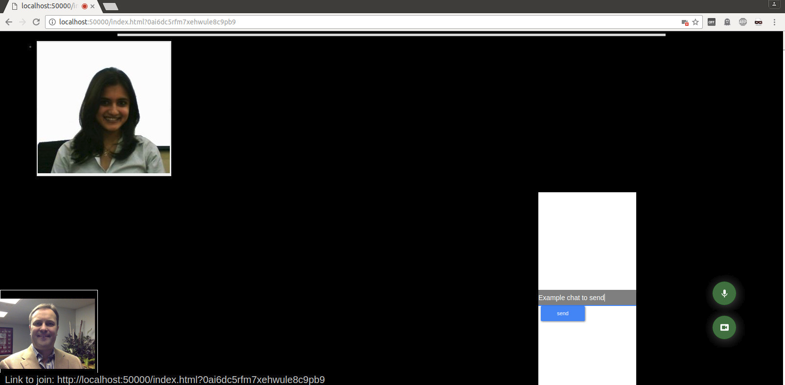

## Incognito Peer to Peer WebRTC encrypted video chat conferencing

Encrypted WebRTC video conferencing app built on Javascript.  Uses peer-to-peer connections for A/V and a centeralized sockets.IO signaling server for command delegation.  Bypasses firewalls and is obfuscation routing network safe (TOR).

## Challenge and Approach

Our approach for satisfying this challenge for the AT&T Mobile App Hackathon​ in 2015 was to:

- Utilize Javascript and P2P web conferencing with an encrypted network layer.
- Video and audio conferencing utilizes Google's VP8 WebP compression and Opus Audio Codec.
- Signaling (muting audio and disabling webcam) and chat uses JSON over communicated over HTTPS websockets

## Lead developer

- [@loudest](https://github.com/loudest)

## Technologies, APIs, and Datasets Utilized

We made use of:
- [JavaScript] - WebRTC, Sockets.IO, JSON communication key encryption over AES

## How to run

1) You first need to have node.JS installed
2) Next run npm install to download the appropriate Javascript dependencies
3) Run the server by: node server.js
4) You will have a URL generated for example: https://localhost:50000/

Go to https://localhost:50000 and you will have an instant P2P encrypted video conferencing app

Your peers will connect via an unique room key generated from the url: https://localhost:50000/?4wuluugvjhhaudgtrzhcnxw29

Once they join, you can have muti-party conferencing.  Currently up to 4 people are only supported.  Chat interface does not poll since no stateful logging is done client side.

Our code is licensed under the [MIT License](LICENSE.md).
